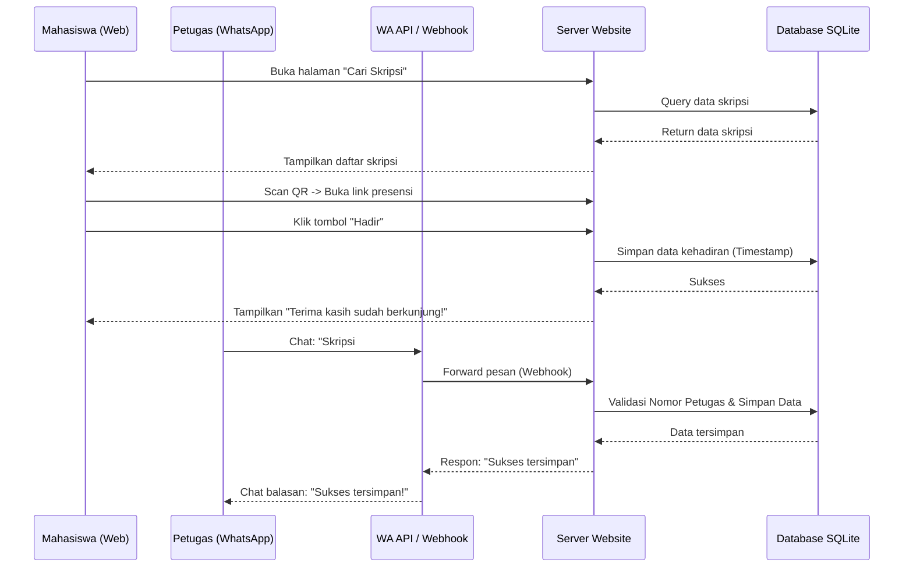
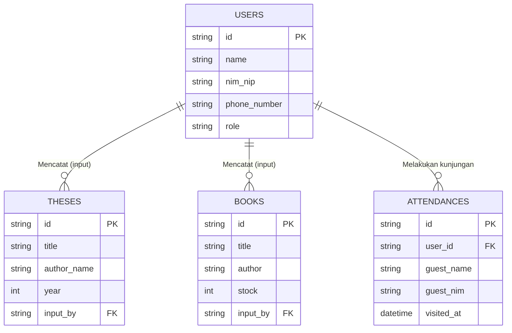

# PRD — Project Requirements Document

## 1. Overview
Website Ruang Baca Program Studi Pendidikan Matematika ini dibangun untuk digitalisasi dan sentralisasi pengelolaan ruang baca. Saat ini, sistem yang berjalan masih serba manual—pencarian skripsi atau buku memakan waktu, pengisian daftar hadir via Google Form cukup merepotkan (ribet), dan input data oleh petugas sangat tidak praktis.

Tujuan utama dari aplikasi ini adalah mempermudah mahasiswa dalam mencari referensi (terutama skripsi kakak tingkat), mempercepat proses presensi dengan sistem yang lebih ringkas (misalnya scan QR Code), menampilkan data kunjungan berupa grafik bagi dosen/admin, serta menghadirkan inovasi *"Input Data via WhatsApp"* agar petugas, dosen, atau admin dapat menambah data buku/skripsi semudah mengirim pesan WA.

## 2. Requirements
1. **Sistem Multi-Pengguna:** Mendukung 4 role dasar dengan hak akses berbeda, yaitu: Admin Prodi, Dosen, Mahasiswa (Pengunjung Umum), dan Mahasiswa Petugas Ruang Baca.
2. **Kemudahan Akses (Mobile-Friendly):** Karena mayoritas pengunjung dan petugas akan menggunakan HP (terutama saat presensi dan chat WA), website harus tampil optimal di layar ponsel.
3. **Presensi Cepat:** Sistem kehadiran yang lebih cepat dari Google Form, menggunakan sistem *Scan QR Code* atau form tunggal satu kali klik.
4. **Integrasi WhatsApp:** Sebuah webhook / bot sederhana yang menerima pesan teks dengan format tertentu dari nomor HP yang terdaftar sebagai Admin/Dosen/Petugas, lalu menyimpannya secara otomatis ke database website.
5. **Dashboard Analitik Sederhana:** Menyediakan visualisasi data (grafik bar / line) untuk melihat tren tingkat kunjungan harian, mingguan, dan bulanan.

## 3. Core Features
* **Katalog Skripsi & Buku:** Fitur pencarian canggih untuk melihat daftar skripsi kakak tingkat dan ketersediaan buku berdasar judul, penulis, atau tahun.
* **Presensi Instan (QR Code):** Pengunjung cukup memindai QR Code yang ditempel di pintu ruang baca, secara otomatis mencatat kehadiran mereka tanpa harus mengetik panjang.
* **Grafik Kehadiran:** Dashboard khusus Admin dan Dosen untuk memantau trafik pengunjung ruang baca dalam bentuk grafik visual yang mudah dipahami.
* **WA-to-Database Input (Fitur Unggulan):** Petugas ruang baca yang sedang sibuk melayani mahasiswa dapat menambah data buku atau skripsi baru hanya dengan mengirim pesan WhatsApp ke nomor sistem (Contoh: `INPUT SKRIPSI#Judul#Penulis#Tahun`). Sistem akan membaca pesan tersebut dan memasukkannya ke website secara *real-time*.
* **Manajemen Role & Pengguna:** Panel admin untuk mengatur siapa saja yang berstatus sebagai Petugas Ruang Baca atau Dosen.

## 4. User Flow

**Alur 1: Mahasiswa Mencari Skripsi (Web)**
1. Mahasiswa membuka website Ruang Baca.
2. Masuk ke menu "Koleksi Skripsi".
3. Mengetikkan kata kunci pencarian.
4. Melihat detail skripsi (Judul, Penulis, Tahun) untuk kemudian dicari letak fisiknya di ruang baca.

**Alur 2: Pengunjung Melakukan Presensi (Ruang Baca)**
1. Pengunjung datang ke Ruang Baca dan scan QR Code menggunakan kamera HP.
2. HP akan membuka halaman presensi di website.
3. Pengunjung (jika sudah login) cukup menekan tombol "Hadir". (Jika belum, cukup masukkan NIM dan Nama).
4. Selesai. Data langsung masuk ke grafik pengunjung.

**Alur 3: Petugas Input Data via WhatsApp**
1. Petugas menerima buku/skripsi baru.
2. Petugas membuka aplikasi WhatsApp di HP-nya.
3. Mengirim pesan sesuai format ke nomor Bot Ruang Baca (Contoh: `Buku#Kalkulus Dasar#James Stewart`).
4. Bot membalas: `"Berhasil! Buku Kalkulus Dasar telah ditambahkan ke sistem."`
5. Data tersebut otomatis muncul di Katalog Website tanpa petugas harus membuka laptop atau login ke web.

## 5. Architecture

Sistem ini menggunakan arsitektur web modern terpusat, ditambah dengan webhook untuk menangani pesan masuk dari WhatsApp API. 

Berikut adalah visualisasi alur kerjanya:

## 6. Database Schema

Berikut adalah rancangan tabel (schema) database utama yang dibutuhkan:

1. **Users (Pengguna)**: Menyimpan data akun.
   * `id` (String/UUID): Primary Key
   * `name` (String): Nama lengkap
   * `nim_nip` (String): Nomor Induk Mahasiswa / Pegawai
   * `phone_number` (String): Nomor WA (Sangat penting untuk validasi input WA)
   * `role` (Enum): 'admin', 'dosen', 'mahasiswa', 'petugas'
2. **Theses (Skripsi)**: Menyimpan data koleksi skripsi kakak tingkat.
   * `id` (String/UUID): Primary Key
   * `title` (String): Judul skripsi
   * `author_name` (String): Nama penulis (kakak tingkat)
   * `year` (Integer): Tahun kelulusan
   * `input_by` (String): Foreign key ke Users (Siapa yang menginput)
3. **Books (Buku)**: Menyimpan data koleksi buku.
   * `id` (String/UUID): Primary Key
   * `title` (String): Judul Buku
   * `author` (String): Penulis Buku
   * `stock` (Integer): Jumlah buku yang tersedia
   * `input_by` (String): Foreign key ke Users
4. **Attendances (Presensi)**: Menyimpan catatan pengunjung.
   * `id` (String/UUID): Primary Key
   * `user_id` (String): Foreign key ke Users (Bisa Null jika tamu tak login)
   * `guest_name` (String): Nama pengunjung (Jika tidak login)
   * `guest_nim` (String): NIM pengunjung (Jika tidak login)
   * `visited_at` (DateTime): Waktu dan tanggal kunjungan berjalan (Otomatis dipakai untuk grafik)

## 7. Tech Stack

Untuk memberikan pengalaman pengguna yang cepat, modern, dan memudahkan pengembangan berkelanjutan, berikut adalah rekomendasi teknologinya:

* **Frontend & Backend (Full-stack Framework):** **Next.js** (Sangat cepat dan cocok untuk membuat aplikasi web yang digabungkan dengan API/Server).
* **Styling & UI Components:** **Tailwind CSS** dipadukan dengan **shadcn/ui** (Menjamin tampilan website terlihat profesional, rapi, dan responsif).
* **Database Relacional & ORM:** **SQLite** diakses melalui **Drizzle ORM** (Ringan, tidak butuh setup server database yang rumit, namun sangat kuat untuk ruang lingkup setingkat program studi).
* **Authentication:** **Better Auth** (Sederhana untuk menangani login dan Role-based access control seperti Admin/Dosen/Petugas).
* **Integrasi WhatsApp:** Menggunakan layanan pihak ketiga seperti **Meta Cloud API (Resmi)**, **Twilio**, atau library sumber terbuka seperti **Baileys** (dipasang di micro-service atau via webhook Next.js untuk membaca pesan masuk secara *real-time*).